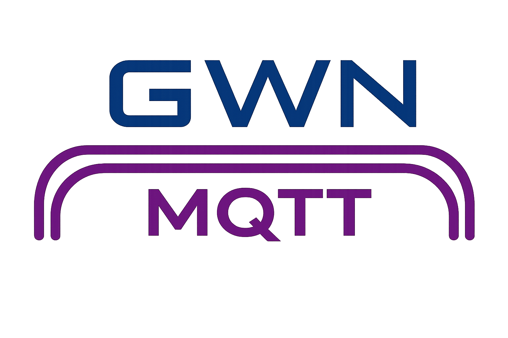

# HomeAssistant-Grandstream-GWN

> [!Important]
> This repository will be moving to
>
> `https://github.com/shopsD/Grandstream-GWN-MQTT-HomeAssistant`
>
> in release v0.0.3



Grandstream GWN Manager tooling for publishing GWN network, access point, and SSID data over MQTT, with optional Home Assistant MQTT discovery. This tool is not endorsed, affiliated nor supported by Grandstream.

The MQTT bridge is the primary working application in this repository. The native Home Assistant custom component is present as a workspace/scaffold, but the MQTT bridge is currently the main implementation path.

## Project Overview

| Path | Purpose |
| --- | --- |
| `gwn/` | Core GWN Manager client, authentication, constants, response models, and request payload models. It also serves as a library/API for interacting with GWN Manager via its API|
| `mqtt/` | Runnable GWN-to-MQTT bridge. It polls GWN Manager, publishes retained MQTT state, receives MQTT commands, and optionally publishes Home Assistant discovery payloads. |
| `custom_components/grandstream_gwn/` | Native Home Assistant integration workspace. This is not the main working integration yet. |

## License
`SPDX-License-Identifier: BSD-3-Clause AND MPL-2.0`

The different components have different licenses as shown below
| Project | License |
| --- | --- |
| `gwn` | MPL-2.0 |
| `mqtt` | BSD-3-Clause |
| `custom_components/grandstream_gwn` | BSD-3-Clause |

## GWN MQTT Bridge

The MQTT bridge does five jobs:

1. Authenticates with GWN Manager using `app_id` and `secret_key`.
2. Optionally performs the username/password browser-style login for richer device, SSID, and edit payload data.
3. Publishes retained MQTT state for the bridge application, networks, devices, and SSIDs.
4. Publishes optional Home Assistant MQTT discovery payloads.
5. Listens for MQTT commands and forwards supported updates back to GWN Manager.

## Requirements

- Python `3.14.2` or newer, matching `pyproject.toml`.
- `uv` for dependency management and running the console script.
- A reachable MQTT broker.
- A reachable Grandstream GWN Manager instance.
- GWN Manager `app_id` and `secret_key`.

### GWN Manager tested versions

- 1.1.35.10

### GWN Manager Accounts

It is recommended you create a custom account and role with limited permissions.
The subset tested permissions for the role are
- Organization
  - Overview
    - Network Management
  - Upgrade
    - Upgrade Configuration
- Network
  - Devices
    - More Buttons
    - Remote Access
    - Device Configuration
    - Auto Configuration Delivery
  - Clients
    - Client Information (Read-only)
  - Wi-Fi
    - Configurate Wireless LAN
    - Configure Global Radio Settings
  - LAN
    - Configure LAN
    - Configure Global Switch Settings
  - Internet
    - Configure WAN
    - Configure Internet Source
  - Profiles
    - Portal Policy (Read-only)
    - Port Profile (read-only)
    - MAC Group (Read-only)
    - Bandwidth Rules (Read-only)
    - Schedule (Read-only)
    - RADIUS (Read-only)
    - PPSK (Read-only)
    - Client Time Policy (Read-only)
    - Hotspot 2.0 (Read-only)
  - System
    - Configure System


## Install

Install `uv` if it is not already available:

```bash
pip install uv
```

Install dependencies:

```bash
uv sync
```

Install development dependencies:

```bash
uv sync --group dev
```

If you are working on the home assistant integration then run this command

```bash
uv sync --extra ha --dev
```

Build the Python package:

```bash
uv build
```

## Run

Edit the sample config found at `mqtt/data/config.yml` with your required details. Refer to [Configuration](#configuration) for more info

Run with the packaged sample config:

```bash
uv run gwn_mqtt --config_path path/to/your/config.yml
```

If `--config_path` is omitted, the application uses the packaged default at `mqtt/data/config.yml`:

```bash
uv run gwn_mqtt
```

The packaged config contains placeholders. For real use, create a private config file from the sample and pass it with `--config_path`.

## CLI Options

| Option | Required | Behaviour |
| --- | --- | --- |
| `-c`, `--config_path PATH` | No | Path to the YAML config file. Defaults to `mqtt/data/config.yml` inside the package. |
| `-p`, `--password [PASSWORD]` | No | Hashes a GWN Manager password and prints the value to use in `gwn.hashed_password`, then exits. |

Password hashing with an interactive prompt:

```bash
uv run gwn_mqtt --password
```

This prompts for the password and then displays the output hashed password.

```bash
uv run gwn_mqtt --password <plain-text-password>
```

This hashes the provided value directly. The output can be used as `gwn.hashed_password` of the config.

This hash is fast and unsalted, so treat it as sensitive and do not expose it.

### Docker

You can either build the docker image manually or use docker compose to pull a pre-built image. To use a pre-built image, skip to [Running with Docker](#running-with-docker)

To build manually, either clone the repository using `git clone` or download the following files and folders
- `Dockerfile`
- `docker-compose.yml`
- `.dockerignore`
- `uv.lock`
- `pyproject.toml`
- `gwn/`
- `mqtt/`

Edit the `docker-compose.yml` file and replace the following line
```yaml
  image: ghcr.io/shopsD/homeassistant-grandstream-gwn:latest
```
with
```yaml
  image: gwn-mqtt-bridge:latest
  build:
    context: .
    dockerfile: Dockerfile
```

#### Running with Docker
Edit the `docker-compose.yml` file and create a `config.yml` file and put it in the root of the directory that you have mapped to the `config` folder in your `docker-compose.yml` file

Run the command
```bash
docker compose up -d
```

Once it has finished building, if you want to generate a hashed password you can run the command
```bash
docker exec -it gwn-mqtt-bridge gwn_mqtt -p
```
to interactively generate the hashed password or 
```bash
docker exec -it gwn-mqtt-bridge gwn_mqtt -p <your_plaintext_password>
```
to non-interactively generate the hashed password

## Definitions

- `Application` refers to the GWN MQTT Bridge Application and does not refer to GWN Manager

## Getting The API Key

The application requires an API key and App ID from GWN Manager to work
To get these details follow the steps below:
1. Login to GWN Manager
2. On the left navigation bar, click on `Organization` to expand it
3. Click on `Global`
4. Scroll down to `API Developer` and click `Enable API Developer Mode`
5. Note your `APP ID` and `Secret Key` (These fields can always be retrieved)
6. If you enable `Restrict APIs to specific networks` then you must set the `restricted_api` to `True` in the config file

## Configuration

The config file is YAML. The supported top-level sections are:

| Section | Required | Purpose |
| --- | --- | --- |
| `gwn` | Yes | GWN Manager authentication, polling, exclusions, and update behaviour. |
| `mqtt` | No | MQTT broker connection, manifest path, and Home Assistant discovery settings. |
| `app` | No | Bridge-level runtime behaviour. |
| `logging` | No | Logging level and destination. |

### Minimal Config

```yaml
gwn:
  url: https://gwn.example.local:8443
  app_id: CHANGE_ME
  secret_key: CHANGE_ME
```

With only `app_id` and `secret_key`, the bridge can poll data available through the official API. Browser-fetched data is unavailable, so features that require username/password login are treated as read-only in Home Assistant discovery.

### Full Example

```yaml
app:
  publish_every_poll: False
  unpublish_initial_data: False
  check_for_updates: True
  allow_pre_release_update: False
mqtt:
  host: 127.0.0.1
  port: 1883
  username: mqtt-user
  password: mqtt-password
  client_id: gwn-mqtt
  keepalive: 60
  topic: gwn
  tls: False
  verify_tls: True
  topic_manifest_path: ./manifest/
  no_publish: False
  homeassistant:
    discovery_topic: homeassistant
    always_publish_autodiscovery: False
    application_autodiscovery: True
    default_network_autodiscovery: True
    default_device_autodiscovery: True
    default_ssid_autodiscovery: True
    network_autodiscovery:
      - 1
      - 2: False
    device_autodiscovery:
      - "AA:BB:CC:DD:EE:FF": True
    ssid_autodiscovery:
      - 3: True
    network_name_override:
      - 1: "Office"
    device_name_override:
      - "AA:BB:CC:DD:EE:FF": "Lobby AP"
    ssid_name_override:
      - 3: "Guest Wi-Fi"

gwn:
  url: https://gwn.example.local:8443
  app_id: CHANGE_ME
  secret_key: CHANGE_ME
  username: CHANGE_ME
  hashed_password: CHANGE_ME
  page_size: 10
  max_pages: 0
  refresh_period_s: 30
  exclude_passphrase:
    - 3
  exclude_ssid:
    - 99
  exclude_device:
    - "AA:BB:CC:DD:EE:00"
  exclude_network:
    - 999
  ignore_failed_fetch_before_update: False
  ssid_name_to_device_binding: True
  no_publish: False

logging:
  level: INFO
  location: console
```

## `app` Config

| Field | Required | Default | Behaviour |
| --- | --- | --- | --- |
| `publish_every_poll` | No | `false` | If `false`, MQTT state is published only when the received GWN payload differs from the previous poll. If `true`, state is published after every GWN poll. |
| `unpublish_initial_data` | No | `false` | If `true`, the bridge fetches the current GWN data on startup, clears matching retained MQTT state/discovery, then republishes fresh state. This is normally not required when `mqtt.topic_manifest_path` is configured. |
| `check_for_updates` | No | `true` | If `true`, the bridge checks if there is a newer version of the bridge on every poll cycle and publishes it over MQTT if a new version is found. The current version will always be published at least once regardless of this setting|
| `allow_pre_release_update` | No | `false` | If `true`, the bridge will notify of a new version even if it is classed as a pre-release version (such as beta). |
## `mqtt` Config

| Field | Required | Default | Behaviour |
| --- | --- | --- | --- |
| `host` | No | `127.0.0.1` | MQTT broker hostname or IP. |
| `port` | No | `1883` | MQTT broker port. |
| `username` | No | `null` | MQTT username. |
| `password` | No | `null` | MQTT password. |
| `client_id` | No | `null` | MQTT client ID. If omitted, the MQTT library generates one. |
| `keepalive` | No | `60` | MQTT keepalive in seconds. |
| `topic` | No | `gwn` | Root MQTT topic used by the bridge. |
| `tls` | No | `false` | Enables TLS for MQTT. |
| `verify_tls` | No | `true` | Verifies MQTT TLS certificates when TLS is enabled. |
| `topic_manifest_path` | No | `null` | Path used to persist published MQTT topics for cleanup across restarts. See `Topic Manifest` below. |
| `no_publish` | No | `false` | Connects and listens for MQTT commands, but does not publish MQTT state/discovery. Useful for debugging. |

If the `mqtt` section is missing, all MQTT defaults are used.

### Topic Manifest

`topic_manifest_path` records every retained topic that the bridge has published. On the next startup, the bridge reads that manifest and clears those retained topics before publishing current data. This prevents stale Home Assistant discovery entities and stale state topics from surviving restarts after networks, devices, SSIDs, or entity shapes have changed.

Path behaviour:

| Value | Behaviour |
| --- | --- |
| Missing or `null` | Manifest support is disabled. No manifest is read or written. |
| Existing folder | `manifest.yml` is created inside that folder. |
| Path ending with `/` or `\` | Treated as a folder path, even if it does not exist yet. `manifest.yml` is created inside it. |
| Any other path | Treated as the manifest file path. Parent folders are created if needed. |

Use `topic_manifest_path: null` or omit the field to disable the manifest.

The manifest file contains entries such as:

```yaml
version: "0.0.1"
topic:
  - gwn/application/status
  - gwn/networks/1/state
```

Invalid manifests are logged and ignored.

`app.unpublish_initial_data` is a separate fallback cleanup mode. It clears topics for whatever data GWN currently returns but only runs once on startup. It is usually not required if `topic_manifest_path` is used.
Using `topic_manifest_path` is more suitable because it can also clear topics for objects that were deleted while the bridge was stopped, while `app.unpublish_initial_data` can only unpublish correctly detected topics (Networks, Devices and SSIDs).

### `mqtt.homeassistant` Config

| Field | Required | Default | Behaviour |
| --- | --- | --- | --- |
| `discovery_topic` | No | `homeassistant` | Root topic for Home Assistant MQTT discovery payloads. |
| `always_publish_autodiscovery` | No | `false` | If `false`, discovery is published once per discovered object until the discovery cache is reset. If `true`, discovery is published whenever matching state is published. |
| `application_autodiscovery` | No | `false` | Enables discovery for the bridge application device. |
| `default_network_autodiscovery` | No | `false` | Default discovery mode for networks not explicitly listed. |
| `default_device_autodiscovery` | No | `false` | Default discovery mode for devices not explicitly listed. |
| `default_ssid_autodiscovery` | No | `false` | Default discovery mode for SSIDs not explicitly listed. |
| `network_autodiscovery` | No | `{}` | Per-network discovery overrides. Keys are network IDs. |
| `device_autodiscovery` | No | `{}` | Per-device discovery overrides. Keys are MAC addresses. |
| `ssid_autodiscovery` | No | `{}` | Per-SSID discovery overrides. Keys are SSID IDs. |
| `network_name_override` | No | `{}` | Overrides the name shown in Home Assistant for a network. Does not rename the GWN network. |
| `device_name_override` | No | `{}` | Overrides the name shown in Home Assistant for a device. Does not rename the AP. |
| `ssid_name_override` | No | `{}` | Overrides the name shown in Home Assistant for an SSID. Does not rename the GWN SSID. |

Discovery override lists accept either a raw ID/MAC or a single key/value pair:

```yaml
network_autodiscovery:
  - 1
  - 2: false
```

In this example, network `1` uses `default_network_autodiscovery`, and network `2` explicitly disables discovery.

Name override lists accept single key/value pairs:

```yaml
device_name_override:
  - "AA:BB:CC:DD:EE:FF": "Lobby AP"
```

## `gwn` Config

| Field | Required | Default | Behaviour |
| --- | --- | --- | --- |
| `app_id` | Yes | None | GWN Manager application ID. |
| `secret_key` | Yes | None | GWN Manager secret key. |
| `url` | No | `https://localhost:8443` | Base URL for GWN Manager. |
| `username` | No | `null` | Optional GWN Manager username for browser-style login. Must be supplied with `password` or `hashed_password`. |
| `password` | No | `null` | Plaintext GWN Manager password. The app hashes it before use. Cannot be supplied with `hashed_password`. |
| `hashed_password` | No | `null` | Pre-hashed GWN Manager password. Cannot be supplied with `password`. |
| `page_size` | No | `10` | Page size for paginated GWN API requests. Must be `>= 1`. |
| `max_pages` | No | `0` | Maximum pages to request. `0` means unlimited. Must be `>= 0`. |
| `refresh_period_s` | No | `30` | Poll interval in seconds. Must be `>= 0`. |
| `exclude_passphrase` | No | `[]` | SSID IDs whose passphrase should not be published. |
| `exclude_ssid` | No | `[]` | SSID IDs to exclude entirely. |
| `exclude_device` | No | `[]` | Device MAC addresses to exclude entirely. |
| `exclude_network` | No | `[]` | Network IDs to exclude entirely. |
| `ignore_failed_fetch_before_update` | No | `false` | Controls whether writes continue when the pre-update fetch fails. |
| `ssid_name_to_device_binding` | No | `true` | Allows SSID-to-device assignment display by matching SSID names when username/password login is unavailable. Ignored when username/password login is available. |
| `no_publish` | No | `false` | Polls GWN Manager but does not send write commands back to GWN Manager. Useful for debug/dry-run style testing. |

### GWN Username And Password Behaviour

`app_id` and `secret_key` are always required.

`username` plus either `password` or `hashed_password` is optional. When present, the bridge can perform browser-style queries for additional data. Those queries are used for complete edit payloads, channel option data, and more accurate SSID/device association data.

| Config Combination | Result |
| --- | --- |
| `username` missing, password fields missing | Valid. Bridge runs in read-only mode for features that need browser-fetched data. |
| `username` set, `password` set | Valid. Plaintext password is hashed before use. |
| `username` set, `hashed_password` set | Valid. Hash is used as-is. |
| `password` and `hashed_password` both set | Invalid. Config load fails. |
| `username` set without a password field | Invalid. Config load fails. |
| Password field set without `username` | Invalid. Config load fails. |

When username/password login is missing, Home Assistant discovery is generated in read-only form for settings that require additional/non-API data. The bridge can still publish state. Reboot, reset, and firmware update buttons are command actions and are not treated as settings writes.

### SSID Name To Device Binding

When `ssid_name_to_device_binding` is `true` and username/password login is unavailable, the bridge can use SSID names to display which devices appear assigned. This is a fallback for display/correlation only. When username/password login is available, the richer fetched data is used instead.

When `ssid_name_to_device_binding` is `false` and username/password login is unavailable, SSID/device assignment data may be empty and write-capable SSID/device discovery should be considered unavailable.

### Update Fetch Behaviour

GWN edit endpoints often require complete payloads, not only the changed field. Before writing network, device, or SSID settings, the bridge fetches current GWN data and builds a fuller payload to avoid resetting unrelated settings.

| `ignore_failed_fetch_before_update` | Behaviour |
| --- | --- |
| `false` | If the pre-update fetch fails, the update is cancelled. |
| `true` | If the pre-update fetch fails, the bridge still attempts the update with the data it has. Missing values may be sent as `null`. This is mainly for external MQTT publishers that provide full payload data themselves. |

## `logging` Config

| Field | Required | Default | Behaviour |
| --- | --- | --- | --- |
| `level` | No | `INFO` | One of `FATAL`, `ERROR`, `WARNING`, `INFO`, `DEBUG`, or `NONE`. |
| `location` | No | `console` | One of `console`, `file`, or `system`. |
| `output_path` | Required for `file` | `null` | File path to write logs when `location: file`. |
| `size` | No | `0` | File rotation size in bytes. `0` disables rotation. |
| `files` | No | `1` | Number of rotated files to keep. Must be `>= 1`. |

Logging destinations:

| Location | Behaviour |
| --- | --- |
| `console` | Logs to the terminal/console. |
| `file` | Logs to `output_path`. If `size > 0`, a rotating file handler is used. |
| `system` | On Windows, logs to Windows Event Log. On non-Windows systems, logs to `/dev/log`; config loading fails if `/dev/log` does not exist. |

`level: NONE` disables normal logging by setting the effective log level above `CRITICAL`.

## MQTT Topics

Assume `mqtt.topic: gwn`. If you change `mqtt.topic`, replace `gwn` in the examples below.

### Published State Topics

| Object | Topic | Payload |
| --- | --- | --- |
| Application status | `gwn/application/status` | `{"status": "online"}` or `{"status": "offline"}`. Retained. |
| Application state | `gwn/application/state` | Application state JSON. Retained. |
| Network state | `gwn/networks/{network_id}/state` | Network state JSON. Retained. |
| Device state | `gwn/networks/{network_id}/devices/{mac}/state` | Device state JSON. Retained. MAC is stripped of ":" and "-" and converted to lower-case in the topic. |
| SSID state | `gwn/networks/{network_id}/ssids/{ssid_id}/state` | SSID state JSON. Retained. |

When an object is removed, the retained state payload is cleared by publishing an empty retained payload to the previous state topic. Home Assistant discovery payloads are also cleared when the discovery cache is reset or an object is unpublished.

### Subscribed Command Topics

| Object | Topic |
| --- | --- |
| Application command | `gwn/application/set` |
| Network command | `gwn/networks/{network_id}/set` |
| Device command | `gwn/networks/{network_id}/devices/{mac}/set` |
| SSID command | `gwn/networks/{network_id}/ssids/{ssid_id}/set` |
| Multi-command envelope | `gwn/gwn/set` |

All command payloads must be valid JSON objects.

## MQTT State Payloads

The exact values come from GWN Manager and can vary by device model, firmware, API support, and whether username/password login is available.

These examples below are the shape of what the application publishes over MQTT

### Application State

```json
{
  "currentVersion": "0.0.1",
  "newVersion": "0.0.1"
}
```

### Network State

```json
{
  "network_id": "1",
  "networkName": "Office",
  "countryDisplay": "United Kingdom",
  "timezone": "Europe/London"
}
```

### Device State

```json
{
  "status": true,
  "apType": "GWN7660",
  "mac": "AA:BB:CC:DD:EE:FF",
  "name": "Lobby AP",
  "ip": "192.168.1.10",
  "upTime": 123456,
  "usage": "1.2 GB",
  "upload": "100 MB",
  "download": "1.1 GB",
  "clients": 12,
  "versionFirmware": "1.0.0",
  "ipv6": "",
  "newFirmware": "",
  "wireless": true,
  "vlanCount": 16,
  "ssidNumber": 3,
  "online": true,
  "model": "GWN7660",
  "deviceType": "AP",
  "channel_5": "36",
  "channel_2_4": "6",
  "channel_6": "",
  "partNumber": "",
  "bootVersion": "",
  "network": "Office",
  "temperature": "42C",
  "usedMemory": "50%",
  "channelload_2g4": "10%",
  "channelload_5g": "20%",
  "channelload_6g": "",
  "cpuUsage": "5%",
  "ap_2g4_channel": 0,
  "ap_5g_channel": 36,
  "ap_6g_channel": 0,
  "channel_lists_2g4": {
    "0": "Use Radio Settings",
    "1": "Ch1-2.412GHz"
  },
  "channel_lists_5g": {
    "0": "Use Radio Settings",
    "36": "Ch36-5.180GHz"
  },
  "channel_lists_6g": {},
  "networkName": "Office",
  "network_id": "1",
  "ssids": [
    {
      "ssid_id": "3",
      "ssidName": "Guest Wi-Fi"
    }
  ]
}
```

`channel_2_4`, `channel_5`, and `channel_6` are the channels currently in use. `ap_2g4_channel`, `ap_5g_channel`, and `ap_6g_channel` are the configured channel settings. A configured value of `0` means `Use Radio Settings`.

### SSID State

```json
{
  "ssid_id": "3",
  "ssidName": "Guest Wi-Fi",
  "wifiEnabled": true,
  "onlineDevices": 5,
  "scheduleEnabled": false,
  "portalEnabled": false,
  "macFilteringEnabled": 0,
  "clientIsolationEnabled": false,
  "ssidIsolationMode": 0,
  "ssidIsolation": false,
  "ssidSsidHidden": false,
  "ssidVlanid": 20,
  "ssidVlanEnabled": true,
  "ssidEnable": true,
  "ssidRemark": "",
  "ssidKey": "redacted-or-empty",
  "ghz2_4_Enabled": true,
  "ghz5_Enabled": true,
  "ghz6_Enabled": false,
  "networkName": "Office",
  "network_id": "1",
  "assignedDevices": {
    "AA:BB:CC:DD:EE:FF": "Lobby AP"
  }
}
```

If `exclude_passphrase` includes the SSID ID, `ssidKey` is not published.

## MQTT Command Payloads
Below are examples of what the commands from MQTT should look like
### Single-Action Command Format

Application, network, device and ssid topic commands use a single action object:

```json
{
  "action": "networkName",
  "value": "New Network Name"
}
```

Button commands may omit `value`:

```json
{
  "action": "reboot"
}
```

### Multi-Command Format

The multi-command topic is useful for external publishers that want to send several actions at once:

```json
{
  "network_id": "1",
  "mac": "AA:BB:CC:DD:EE:FF",
  "action": [
    {
      "action": "ap_name",
      "value": "Lobby AP"
    },
    {
      "action": "ap_5g_channel",
      "value": 36
    }
  ]
}
```

For SSID multi-commands, use `ssid_id` instead of `mac`:

```json
{
  "network_id": "1",
  "ssid_id": "3",
  "action": [
    {
      "action": "ssidName",
      "value": "Guest Wi-Fi"
    },
    {
      "action": "ssidEnable",
      "value": true
    }
  ]
}
```

Rules for `gwn/gwn/set`:

| Rule | Behaviour |
| --- | --- |
| `network_id` missing | Treated as an application command. `mac` and `ssid_id` must also be absent. |
| `mac` and `ssid_id` both present | Invalid. Only one target type can be used. |
| `action` is not a list of objects | Invalid. |
| Duplicate action keys | Later values overwrite earlier values before the handler is called. |

## Supported Command Actions

### Application Actions

| Action | Value | Behaviour |
| --- | --- | --- |
| `update_version` | Optional | Placeholder application update action. |
| `restart` | Optional | Placeholder application restart action. |

### Network Actions

| Action | Value | Behaviour |
| --- | --- | --- |
| `networkName` | string | Rename the network. |
| `country` | string/int depending on GWN payload | Low-level GWN network country value. |
| `timezone` | string | Low-level GWN timezone value. |
| `networkAdministrators` | list | Low-level GWN network administrator IDs. |

### Device Actions

Discovery-backed actions:

| Action | Value | Behaviour |
| --- | --- | --- |
| `reboot` | omitted/null | Reboot the AP. |
| `update_firmware` | omitted/null | Trigger firmware update. |
| `reset` | omitted/null | Reset the AP. |
| `networkName` | network ID/name mapping value | Move the AP to another network. Home Assistant discovery shows the configured display name while sending the selected network ID. |
| `ap_2g4_channel` | integer | Set the configured 2.4 GHz channel. `0` means `Use Radio Settings`. |
| `ap_5g_channel` | integer | Set the configured 5 GHz channel. `0` means `Use Radio Settings`. |
| `ap_6g_channel` | integer | Set the configured 6 GHz channel. `0` means `Use Radio Settings` |

Additional low-level device actions accepted by the MQTT manager:

```text
ap_2g4_power
ap_2g4_ratelimit_enable
ap_2g4_rssi
ap_2g4_rssi_enable
ap_2g4_tag
ap_2g4_width
ap_5g_power
ap_5g_ratelimit_enable
ap_5g_rssi
ap_5g_rssi_enable
ap_5g_tag
ap_5g_width
ap_alternate_dns
ap_band_steering
ap_ipv4_route
ap_ipv4_static
ap_ipv4_static_mask
ap_name
ap_preferred_dns
ap_static
ap_6g_power
ap_6g_ratelimit_enable
ap_6g_rssi
ap_6g_rssi_enable
ap_6g_tag
ap_6g_width
```

### SSID Actions

Discovery-backed actions:

| Action | Value | Behaviour |
| --- | --- | --- |
| `ssidEnable` | boolean | Enable or disable the SSID. |
| `portalEnabled` | boolean | Enable or disable captive portal. |
| `ssidVlanid` | integer | Set VLAN ID. |
| `ssidVlanEnabled` | boolean | Enable or disable VLAN. If omitted while `ssidVlanid` is supplied, the bridge infers it from whether VLAN ID is greater than `0`. |
| `ghz2_4_Enabled` | boolean | Enable or disable 2.4 GHz radio support for the SSID. |
| `ghz5_Enabled` | boolean | Enable or disable 5 GHz radio support for the SSID. |
| `ghz6_Enabled` | boolean | Enable or disable 6 GHz radio support where supported. |
| `ssidKey` | string | Set passphrase/key. |
| `ssidSsidHidden` | boolean | Hide or show SSID. |
| `ssidName` | string | Rename SSID. |
| `ssidIsolation` | boolean/int depending on GWN payload | Set SSID isolation value. |
| `toggle_device` | dictionary of devices to toggle assignment. `{"AA:BB:CC:DD:EE:F0": true}` | Toggle SSID assignment for one or more devices. Key is the device MAC. Set the dictionary value to `True` to add the assignment, `False` to remove the assignment |

Additional low-level SSID actions accepted by the MQTT manager:

```text
ssidRemark
ssidRadiusDynamicVlan
ssidNewSsidBand
ssidWifiClientLimit
ssidEncryption
ssidWepKey
ssidWpaKeyMode
ssidWpaEncryption
ssidWpaKey
ssidBridgeEnable
ssidIsolationMode
ssidGatewayMac
ssidVoiceEnterprise
ssid11V
ssid11R
ssid11K
ssidDtimPeriod
ssidMcastToUcast
ssidProxyarp
ssidStaIdleTimeout
ssid11W
ssidBms
ssidClientIPAssignment
bindMacs
removeMacs
ssidPortalPolicy
ssidMaclistBlacks
ssidMaclistWhites
ssidMacFiltering
scheduleId
ssidTimedClientPolicy
bandwidthType
bandwidthRules
ssidSecurityType
ppskProfile
radiusProfile
```

For details on the supported values of these fields, refer to [Grandstream GWN API](https://doc.grandstream.dev/GWN-API/EN/#api-160094196075101000035)

`bindMacs` and `removeMacs` are low-level GWN payload fields. Home Assistant assignment controls normally use `toggle_device` plus fetched assignment state rather than requiring a user to manually build those fields.

## Publishing, Caching, And Unpublishing

The bridge caches the last published network, device, and SSID payloads.

| Event | Behaviour |
| --- | --- |
| Startup with `topic_manifest_path` | Topics listed in the previous manifest are cleared before the bridge starts its polling/listening tasks. |
| Startup with `unpublish_initial_data: true` | Current GWN data is fetched and matching retained topics/discovery are cleared before fresh data is published. |
| Normal poll with no changes | No state is published unless `app.publish_every_poll` is `true`. |
| Normal poll with changes | Only changed network/device/SSID payloads are published. |
| Object removed from GWN | The old retained MQTT state and matching discovery payloads are cleared. |
| Name/assignment/option shape changes | Discovery cache is reset so Home Assistant can receive the updated entity shape. |
| Publish failure during cleanup | The old cache entry is restored so cleanup can be retried on the next poll. |

Home Assistant discovery payloads are retained. Publishing an empty retained payload to the discovery config topic removes the entity from Home Assistant.

## Home Assistant Discovery

Home Assistant discovery is controlled by `mqtt.homeassistant`.

The bridge can create discovery entities for:

| Scope | Examples |
| --- | --- |
| Application | Current version, available version, update, restart. |
| Network | Name, country, timezone. |
| Device | Wireless state, status, IPs, firmware, CPU, temperature, SSID list, current channels, configured channel selects, reboot/reset/update. |
| SSID | Enable, portal, isolation, hidden SSID, VLAN, passphrase, SSID name, client count, network, assigned device controls. |

When GWN username/password login is unavailable, write-capable entities that rely on browser-fetched data are published as read-only sensors/binary sensors instead. Device command buttons such as reboot, reset, and firmware update are still command entities because they do not change stored settings.

Name overrides affect only the Home Assistant discovery display names. State topics and GWN payload values continue to use the underlying GWN identifiers and values.

## Development Commands

Run Ruff:

```bash
uv run ruff check .
```

Run mypy:

```bash
uv run mypy custom_components/grandstream_gwn gwn mqtt
```

Run compile checks:

```bash
uv run python -m compileall -q custom_components/grandstream_gwn gwn mqtt
```

If you want to run tools directly from the virtual environment:

```bash
.venv/bin/ruff check .
.venv/bin/python -m mypy custom_components/grandstream_gwn gwn mqtt
.venv/bin/python -m compileall -q custom_components/grandstream_gwn gwn mqtt
```

## Security Notes

- Treat `app_id`, `secret_key`, MQTT credentials, GWN credentials, `hashed_password`, and the topic manifest as sensitive operational data.
- Prefer `gwn.hashed_password` over storing plaintext `gwn.password`.
- Do not set both `gwn.password` and `gwn.hashed_password`.
- Excluding the SSID passphrase from MQTT state does not remove GWN Manager's requirement for a complete SSID edit payload. The application will attempt to acquire the SSID passphrase before making updates per the configuration settings.
- MQTT command topics can change real GWN settings. Protect the broker accordingly. If in doubt, use `no_publish: True`  in the MQTT section of the config.
- Using `no_publish: True` in the config will result in the full payload being written to the log if the log is set to `debug`. This is unencrypted and un-obscured, so SSID passwords will be made visible in this log regardless of if the SSID was excluded from passkey publishing. `GWN Manager` passwords (Plaintext or Hashed) are never written to the log
- Receiving a malformed MQTT payload will display the entire payload in the log if the log is set to `debug`. This is unencrypted and un-obscured, so SSID passwords will be made visible in this log regardless of if the SSID was excluded from passkey publishing. `GWN Manager` passwords (Plaintext or Hashed) are never written to the log

## Additional Notes

- Due to the way the Grandstream API works, several values cannot be retrieved via an API key alone. This is why username and password are required. This includes identifying what SSIDs are assigned to a device by SSID ID rather than name since the GWN Manager allows SSIDs with the same name
- When using the Home Assistant MQTT payloads, sometimes a value will briefly toggle to its old value after editing. This is because after changing a value, the application retrieves the latest values from GWN Manager and republishes it over MQTT. This delay makes Home Assistant reset to the old value, but it should change to the new value within a few seconds
- MAC Addresses must either use `:` or `-` as separators. No separators are also supported. The application does attempt to normalise them, so the values are not case sensitive
- Many GWN API Commands/Response parameters are not fully documented or officially supported. This is particularly true with 6GHz related parameters. While Grandstream customer support have provided additional confirmation of some variables and behaviours, some items use workarounds such as the "browser based calls" (calls that copy what the GWN Manager Web App does) using username/password have been implemented. However, since these are not part of the official API, they may be prone to breaking in future updates. This was tested against Version `1.1.35.10` of the official GWN Manager Application
- Boolean values in the config must never be in quotes otherwise they can be incorrectly processed
- GWN Cloud has not been tested with this application

## Roadmap Notes

| Area | Notes |
| --- | --- |
| Native Home Assistant integration | Build a real config flow, coordinator, read-only entities, then write-capable entities. |
| Tests | Add pytest coverage once the behaviour settles. |
| Web UI | Possible stretch goal |
